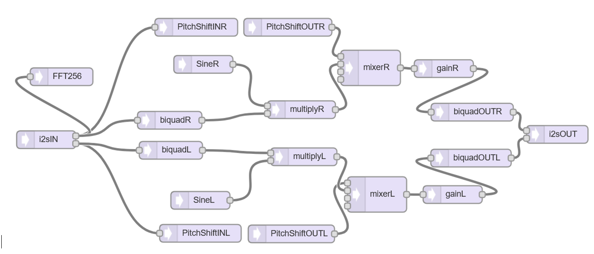

  # Super Ears

  Have you ever dreamt of being able to hear like a bird or a bat or an insect ?
  You are getting/feeling old and your ears loose the ability to perceive high frequency sound (like mine), and you want to hear again like a 12-year old (or even like a 12-year old bat) ?
  You like soldering and tinkering with a suberb microcontroller ?
  
  If yes, then SUPER EARS is the right toy for you.

  It uses very good stereo ultra low noise mics (audio: AOM5024 or ultrasound: ICS40730), a stereo preamp, a stereo ADC, a Teensy 4.1 microcontroller and a stereo DAC to shift your desired audio or ultrasound into your preferred frequency range. One button lets you toggle between pitch shift modes, two other buttons adjust the heterodyne frequency, the pot adjusts the volume.

  

  ### Features:
  * spatial sound pickup (3D), so you can locate the sound you want to hear, it uses stereo headphones with attached mics on each ear
  * real time audio pitch shift by 1, 1.5 or 2 octaves
  * ultrasound heterodyne frequency shift (automatic or manual frequency adjustment)
 
  ### Why do I need this ?
  * Compensating my age-related high frequency loss for bird and Orthoptera field work
  * automatic heterodyne detector for hearing and studying bats
  * because its cool to hear in 3D where all those catydids sit and sing in those hot summer nights

  ### How does this work technically ?
  * the software on the Teensy 4.1 implements pitch shifting in the time domain and is based on an idea by Lang Elliott & Herb Susmann for the "Hear birds again"-project, specifically for the now deprecated SongFinder pitch shifter units. 
  * The algorithm can shift the audio down by a factor of two (one octave), three (1.5 octaves) or four (two octaves).

  * This graph shows the implementation for the case of downshifting by 4:

 

 ### What is the hardware setup ?
 * Stereo headphones with two AOM5024 attached to each earphone (if you prefer ultrasound detection, use ICS40730) -> inspired by hearbirdsagain.com
 * Teensy 4.1
 * two Audio preamp PCBs by Elector (modified: low noise TL972 opamps and caps and resistors adjusted for ultrasound response)

 * ADC PCM1808
 * DAC PCM5102
 * separate power supply for the preamp with lithium ion battery to suppress noise

### Screenshots:

### pitch shift mode

### Manual heterodyne mode

  
  
   PCM5102A DAC module
    VCC = Vin
    3.3v = NC
    GND = GND
    FLT = GND
    SCL = 23 / MCLK via series 100 Ohm
    BCK = BCLK (21)
    DIN = TX (7)
    LCK = LRCLK (20)
    FMT = GND
    XMT = 3.3V (HIGH)
    
    PCM1808 ADC module:    
    FMT = GND
    MD1 = GND
    MD0 = GND
    GND = GND
    3.3V = 3.3V --> ADC needs both: 5V AND 3V3
    5V = VIN
    BCK = BCLK (21) via series 100 Ohm
    OUT = RX (8)
    LRC = LRCLK (20) via series 100 Ohm
    SCK = MCLK (23) via series 100 Ohm
    GND = GND
    3.3V = 3.3V

   Credits:   
   
   * Many thanks go to Harold Mills & Lang Elliott for explaining this algorithm to me and answering my questions ! :-) 
  https://hearbirdsagain.org/
   * Many thanks to Jean-Do Vrignault for the Teensy Recorder code!
   
   OLED display SSH1106
   
   Vcc = Vcc 3.3V
   GND = GND
   SCL 19
   SDA 18
   SCL & SDA each with a pull-up 4K7 resistor to 3V3 
   
   Potentiometer  pin 17
   Buttons
   UP      30 
   DOWN    32
   PUSH    31
